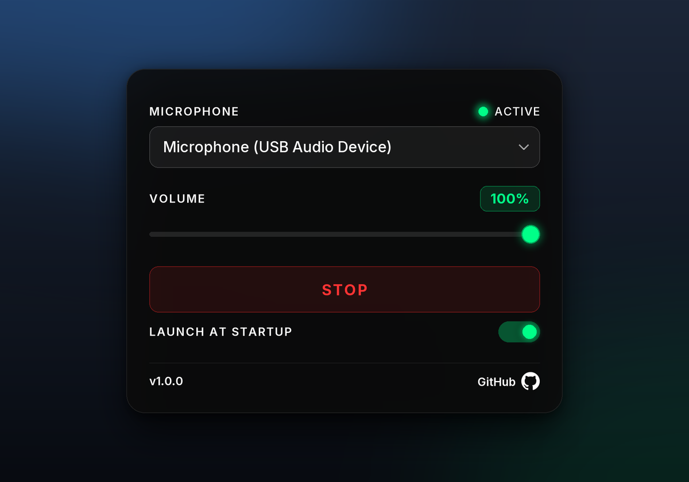

<p align="center">
  <a href="README.ru.md"> Русский</a> &nbsp;&nbsp;
  <a href="../README.md"> English</a> &nbsp;&nbsp;
  <a href="README.fr.md"> Français</a> &nbsp;&nbsp;
   <b>Español</b> &nbsp;&nbsp;
  <a href="README.de.md"> Deutsch</a> &nbsp;&nbsp;
  <a href="README.it.md"> Italiano</a>
</p>
<p align="center">
  <a href="README.pl.md"> Polski</a> &nbsp;&nbsp;
  <a href="README.pt.md"> Português</a> &nbsp;&nbsp;
  <a href="README.ja.md"> 日本語</a> &nbsp;&nbsp;
  <a href="README.ko.md"> 한국어</a> &nbsp;&nbsp;
  <a href="README.zh.md"> 中文</a> &nbsp;&nbsp;
  <a href="README.hi.md"> हिन्दी</a>
</p>

<p align="center">
  
</p>

---

# MicLocker

MicLocker es una aplicación de escritorio ligera para Windows que te permite seleccionar un dispositivo de audio específico como micrófono y establecer su nivel de volumen. La aplicación monitorea y mantiene automáticamente el nivel de volumen elegido en un bucle continuo.

## Vista previa

<p align="center">
  
</p>

## Características

- Seleccionar micrófono entre los dispositivos de entrada de audio disponibles
- Establecer nivel de volumen (0–100 %)
- Mantenimiento automático del volumen cada segundo
- Interfaz limpia y minimalista

## Inicio rápido

### Desarrollo

```bash
# Install dependencies
npm install

# Run in development mode
npm run tauri dev
```

### Compilación

```bash
npm run tauri build
```

Después de compilar, encontrarás los ejecutables en:

- **MSI**: `src-tauri/target/release/bundle/msi/MicLocker_*_x64_en-US.msi`
- **NSIS**: `src-tauri/target/release/bundle/nsis/MicLocker_*_x64-setup.exe`
- **Standalone EXE**: `src-tauri/target/release/miclocker.exe`

## Stack tecnológico

- **Frontend**: React + TypeScript + Vite
- **Backend**: Rust + Tauri v2
- **API de Windows**: Crate `windows` para acceder a Core Audio API

## Requisitos

- Windows 10/11
- Node.js 18+
- Toolchain de Rust (para compilar desde el código fuente)

## Licencia

MIT
